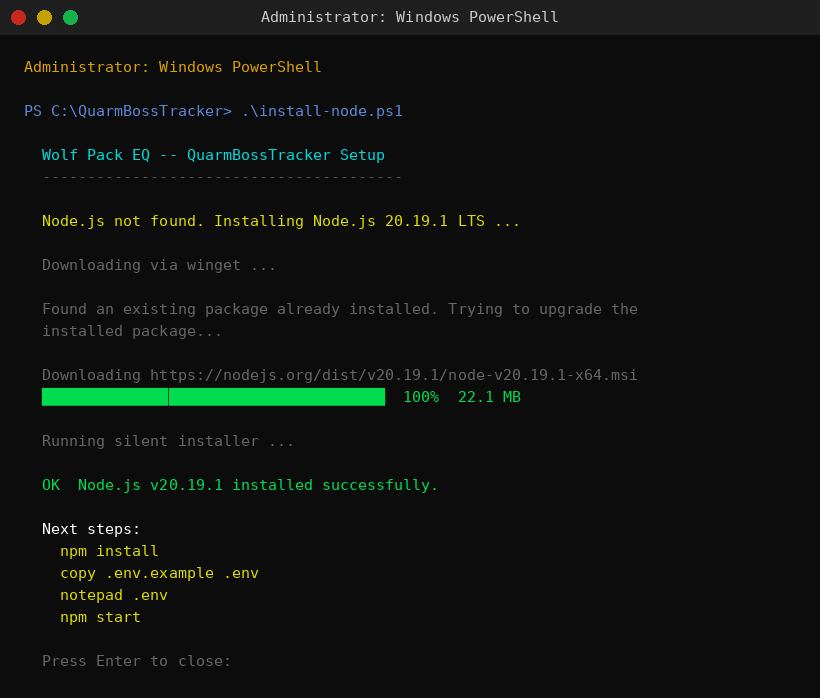
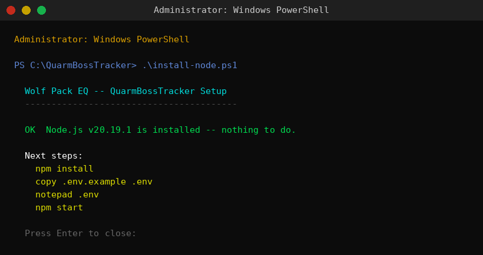
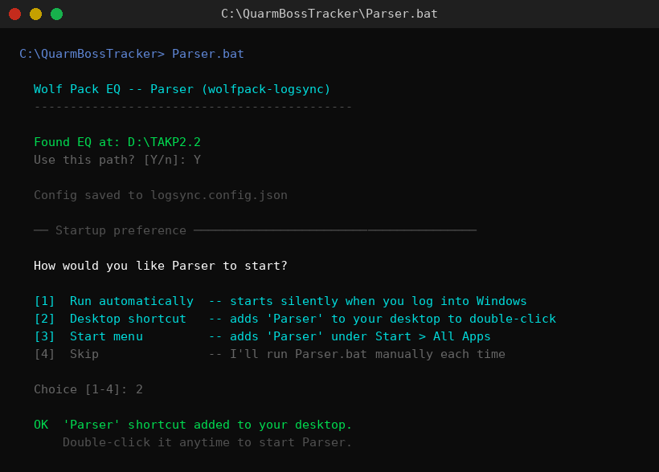
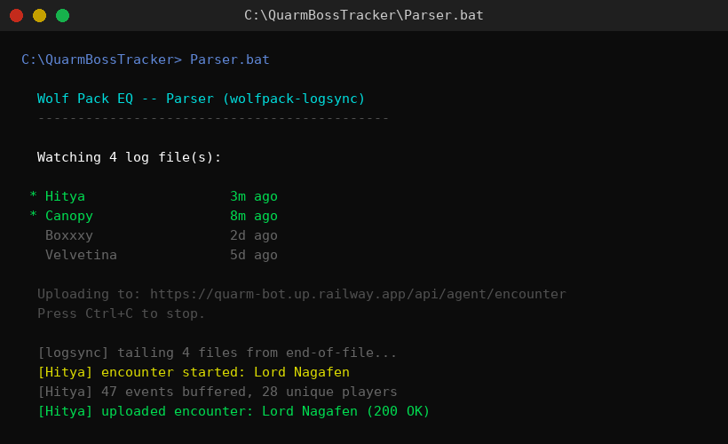

# Quarm Raid Timer Bot

A Discord bot for tracking instanced raid boss spawn timers on Project Quarm (EverQuest TLP server, Luclin era).
Timer data sourced from [PQDI.cc](https://www.pqdi.cc/instances).

**Version:** 2.0.7 · **Runtime:** Node.js 20, discord.js v14 · **Deployment:** Railway + Supabase

---

## Local Installation (Windows)

### 1 — Check / install Node.js

Right-click `install-node.ps1` in the repo root → **Run with PowerShell** (as Administrator).  
The script checks whether Node.js 20+ is already present and installs it automatically if not.

**First run — Node.js not installed:**



**Node.js already installed:**



### 2 — Configure and start

Open a normal PowerShell or Command Prompt window in the repo folder:

```powershell
npm install
copy .env.example .env
notepad .env        # fill in your Discord token and channel IDs
npm start
```

> **Tip:** the bot auto-registers slash commands on every startup — no separate deploy step needed.

### 3 — Stream your EQ log (optional but recommended)

Double-click **`Parser.bat`** in the repo folder. That's it. No PowerShell execution policy to fight with — the `.bat` file handles everything.

Parser watches every recently-active EQ log file simultaneously (no need to pick a character) and uploads encounter data to the bot while you raid.

**First run** — auto-detects your EQ directory across all drives (`C:\`, `D:\`, `E:\`, etc.) looking for `EverQuest`, `EQ`, `TAKP`, `TAKP2.2`, and standard install paths. Asks for the bot URL and token (get these from an officer), then **copies itself into your EQ directory** — which is typically already excluded from Windows Defender — and offers three startup options:



| Option | What it does |
|--------|-------------|
| **Run automatically** | Registers a Windows Task Scheduler task — Parser starts silently in the background every time you log into Windows. No window, no clicks needed. |
| **Desktop shortcut** | Adds a "Parser" shortcut to your desktop — double-click it before a raid. |
| **Start menu** | Adds "Parser" under Start → All Apps. |

After first run the repo copy is no longer needed. Everything (`Parser.bat`, `start-logsync.ps1`, `wolfpack-logsync\index.js`, `logsync.config.json`) lives inside your EQ directory. Shortcuts and the scheduled task point there directly.

**Subsequent runs:**



**What gets watched:** any `eqlog_*_pq.proj.txt` modified in the last 30 days. Characters active in the last hour show in green with `*`. Idle log files sit at zero cost until that character logs in.

**Privacy:** all filtering is local. Officer chat, tells, guild chat, and custom channels are dropped before any upload. Only combat events from detected boss encounters are sent.

**Flags** (pass via `start-logsync.ps1` directly if needed):

| Flag | Description |
|------|-------------|
| `-DryRun` | Parse locally, print summaries — nothing uploaded |
| `-StaleAfterDays 7` | Tighten the "recently active" window (default: 30) |
| `-EqDir "D:\TAKP"` | Override EQ path without re-prompting |
| `-Setup` | Re-run the startup wizard (change auto-start/shortcut preference) |
| `-Remove` | Remove the scheduled task and any shortcuts |
| `-Reset` | Forget all saved config and start over |

---

## Channel Layout

### `#raid-mobs` (main channel)

Four fixed message slots, always edited in place — never re-posted:

| Slot | Content |
|------|---------|
| 1 | 📊 Active Cooldowns (all expansions) |
| 2 | 🌅 Spawning in the Next 24 Hours |
| 3 | 📅 Daily Raid Summary (resets midnight) |
| 4 | Thread links (one message, all 5 expansions) |

### Expansion Threads (inside `#raid-mobs`)

One thread per expansion. Each thread contains:
1. **Active Cooldowns card** — edited in place at the top
2. **Zone kill cards** — posted when bosses are killed, edited/deleted as timers clear
3. **Board panels** with kill buttons — edited in place

| Thread | Env Var |
|--------|---------|
| Classic | `CLASSIC_THREAD_ID` |
| Kunark | `KUNARK_THREAD_ID` |
| Velious | `VELIOUS_THREAD_ID` |
| Luclin | `LUCLIN_THREAD_ID` |
| PoP | `POP_THREAD_ID` |

### Historic Kills Thread — `HISTORIC_KILLS_THREAD_ID`

Receives midnight daily summaries, zone kill cards when bosses respawn, and archived `/announce` messages.

### Onboarding Thread — `ONBOARDING_THREAD_ID`

Hosts the public Quick Start instructions and the encrypted opt-out registry (salted SHA-256 hashes — no plaintext user IDs).

### Parse Logs Thread — `PARSES_LOG_THREAD_ID`

Every `/parse` submission is archived here as a JSON embed. This is the **source of truth** for parse data and survives Railway volume wipes — the bot rebuilds `parses.json` from this thread on every startup.

---

## Commands

### Kill Tracking

| Command | Description |
|---------|-------------|
| `/kill <boss>` | Record a kill, start the respawn timer, post a zone kill card in the expansion thread |
| `/unkill <boss>` | Clear a kill record, remove the boss from the zone kill card |
| `/updatetimer <boss> <time>` | Override the next-spawn time (e.g. `"3d4h30m"`, `"Expires in 3 Days, 4 Hours"`) |
| `/timers [zone] [filter]` | View spawn timers — filter by zone (autocomplete, 33+ zones) or status |
| `/board` | Post or in-place refresh all 4 main-channel slots and all expansion thread boards |
| `/cleanup` | Remove duplicate/stale messages, re-anchor boards to earliest copies |
| `/restore <links...>` | Rebuild kill state from any Active Cooldowns or Daily Summary message links |

### Parse Tracking

| Command | Description |
|---------|-------------|
| `/parse <data>` | Submit an EQLogParser "Send to EQ" DPS parse — boss auto-detected from the header |
| `/parseboss <boss> <data>` | Submit a parse with explicit boss selection |
| `/parsestats <boss>` | DPS scoreboard and raidwide metrics for a boss across all stored kills |
| `/parseaoe <data>` | Submit an AoE parse combining damage within a 5-minute window (max damage per player) |
| `/parsenight [public]` | Full-night DPS summary across every kill tonight |
| `/raidnight` | Open tonight's raid parse thread with a live rolling scoreboard |
| `/mystats <character>` | Per-character DPS stats — kills, avg DPS, peak DPS, per-boss breakdown (ephemeral) |
| `/mystatsall <character>` | Same as `/mystats` but aggregates across the full main + alt family |
| `/parseleaderboard` | Post/update a pinned leaderboard in the parse log thread (officer only) |

EQLogParser "Send to EQ" format:
```
<Boss> in <N>s, <X>K/<X>M Damage @<X>K, 1. Player = <X>K@<X> in <X>s | ...
```

### Raid Announcements

| Command | Description |
|---------|-------------|
| `/announce time:<when> [boss:<name>] [zone:<zone>] [note:<text>]` | Create a raid announcement, a thread, and a Discord event |
| `/addtarget <boss>` | Add a boss to the active announce thread's target list |
| `/removetarget <boss>` | Remove a boss from the target list |
| `/adjusttime <time>` | Update the raid time in the announce thread and Discord event |
| `/adjustdate <date>` | Update the raid date (e.g. `"Friday"`, `"4/30"`) |

**Time formats:** `"8:30 PM"`, `"Thursday 9pm"`, `"tomorrow 8pm"`, `"8:30 PM EST"`, `"in 2 hours"`

The announce thread contains a live control panel. Use the **Cancel Event** button to cancel and archive.

### PVP Tracking

| Command | Description |
|---------|-------------|
| `/pvpkill <mob>` | Record a PVP mob kill — timer pulled from bosses.json, card posted to `PVP_KILLS_THREAD_ID` |
| `/pvpspawn <mob>` | Clear a PVP mob timer when it spawns; ephemeral reply with "Alert PVP" button to rally the pack |
| `/pvpunkill <mob>` | Remove a PVP kill record without sending an alert |
| `/quake [time]` | Schedule a quake (`"now"`, `"9pm"`, `"in 2 hours"`) — resets all PVP mob timers, creates a Discord event |
| `/pvprole [silent]` | Toggle your @PVP role; without `silent`, posts a wolf announcement to the PVP channel |
| `/pvpalert <zone>` | Ping @PVP with a howl message; other users click 🐺 Howl! to join |

### Boss Management

| Command | Description |
|---------|-------------|
| `/addboss <pqdi_url>` | Scrape a PQDI.cc NPC page, add to `bosses.json`, refresh the board |
| `/removeboss <boss>` | Remove a boss, clear its kill state, refresh the board |

### Help & Onboarding

| Command | Description |
|---------|-------------|
| `/raidbosshelp` | Full command reference (ephemeral) |
| `/onboarding` | Show the Wolf Pack welcome message again, or toggle your opt-out preference |

---

## Onboarding System

When a new member joins, the bot sends them a welcome message (DM, or falls back to the onboarding thread) covering the three pillars of coordination: accountability, timing, and announcements. Buttons let them indicate intent (PVP, organizer, or attendee) and see tailored follow-up.

- **Opt out:** Click "Don't show me this again" in the welcome message. The bot records a salted SHA-256 hash of the user ID — no plaintext IDs are stored anywhere.
- **Opt back in / view again:** Run `/onboarding` at any time.
- **Version tracking:** The opt-out includes the bot version. If a new version ships new commands, opted-out users receive a brief "what's new" notice.
- **Registry:** Stored as an embed in `ONBOARDING_THREAD_ID` and reloaded on every startup.

---

## Setup: Discord Developer Portal

1. Go to [discord.com/developers/applications](https://discord.com/developers/applications)
2. **New Application** → name it → **Bot** tab → **Reset Token** → copy the **Bot Token**
3. Enable **Server Members Intent** under Privileged Gateway Intents
4. **General Information** → copy your **Application ID** (`DISCORD_CLIENT_ID`)
5. **OAuth2 → URL Generator:**
   - Scopes: `bot` and `applications.commands`
   - Bot Permissions: `Send Messages`, `Embed Links`, `Read Message History`, `Manage Messages`, `Manage Events`, `Manage Roles`
6. Copy the generated URL and invite the bot to your server

> `Manage Events` is required for Discord Scheduled Events created by `/announce` and `/quake`.
>
> `Manage Roles` is required for `/pvprole` to add and remove the @PVP role.
>
> **Server Members Intent** is required for the member-join onboarding messages.

---

## Deployment

### Railway (recommended)

1. Push this repo to GitHub
2. [railway.app](https://railway.app) → **New Project** → **Deploy from GitHub repo**
3. Add all variables from `.env.example` under the **Variables** tab
4. Add a **Volume** at mount path `/app/data` to persist `state.json` and `bosses.json`

### Docker

```bash
cp .env.example .env
nano .env          # fill in your values
docker-compose up -d
docker-compose logs -f

# To update:
git pull && docker-compose down && docker-compose up -d --build
```

### Local / Development (Windows)

See [Local Installation](#local-installation-windows) at the top of this file.  
The `install-node.ps1` script handles Node.js setup; then `npm install && npm start`.

---

## First-Time Setup Order

1. Create 5 expansion threads inside `#raid-mobs`: Classic, Kunark, Velious, Luclin, PoP
2. Create a Historic Kills thread inside `#raid-mobs`
3. Create a Parse Logs thread (e.g. "Parse Logs") — paste its ID into `PARSES_LOG_THREAD_ID`
4. Create an Onboarding thread (e.g. "Getting Started") — paste its ID into `ONBOARDING_THREAD_ID`
5. Optionally create a PVP channel or thread
6. Add all thread/channel IDs to your env vars
7. Deploy the bot
8. Run `/board` — creates all 4 main-channel slots and posts boards in each thread
9. Right-click each anchored message → Copy ID → add to env vars (prevents re-posting on redeploy)
10. Run `/board` again to confirm everything edits in place (no new messages posted)

### Recovery After State Loss

```
/restore <link1> [<link2> ...]
```

Paste links to any combination of Active Cooldowns cards and Daily Raid Summary messages. The most recent `nextSpawn` per boss wins. Parse data is recovered automatically from the Parse Logs thread on startup.

---

## Environment Variables

### Required

| Variable | Description |
|----------|-------------|
| `DISCORD_TOKEN` | Bot token from Discord Developer Portal |
| `DISCORD_CLIENT_ID` | Application ID |
| `DISCORD_GUILD_ID` | Server ID |
| `TIMER_CHANNEL_ID` | `#raid-mobs` main channel ID |
| `CLASSIC_THREAD_ID` | Classic expansion thread ID |
| `KUNARK_THREAD_ID` | Kunark expansion thread ID |
| `VELIOUS_THREAD_ID` | Velious expansion thread ID |
| `LUCLIN_THREAD_ID` | Luclin expansion thread ID |
| `POP_THREAD_ID` | PoP expansion thread ID |
| `HISTORIC_KILLS_THREAD_ID` | Historic Kills thread ID |
| `PARSES_LOG_THREAD_ID` | Parse Logs thread ID (parse data source of truth) |
| `ONBOARDING_THREAD_ID` | Onboarding thread ID (quick-start instructions + opt-out registry) |
| `ALLOWED_ROLE_NAMES` | Comma-delimited role names (e.g. `Pack Member,Officer,Guild Leader`) |

### Hardcoded Slot Anchors (recommended — paste once, survive any redeploy)

| Variable | Description |
|----------|-------------|
| `SUMMARY_MESSAGE_ID` | Active Cooldowns message in main channel |
| `SPAWNING_TOMORROW_MESSAGE_ID` | Spawning Tomorrow message |
| `DAILY_SUMMARY_MESSAGE_ID` | Daily Summary message |
| `THREAD_LINKS_MESSAGE_ID` | Thread links message |
| `CLASSIC_BOARD_IDS` | Comma-delimited board panel message IDs for Classic thread |
| `KUNARK_BOARD_IDS` | Kunark board IDs |
| `VELIOUS_BOARD_IDS` | Velious board IDs |
| `LUCLIN_BOARD_IDS` | Luclin board IDs |
| `POP_BOARD_IDS` | PoP board IDs |
| `CLASSIC_COOLDOWN_ID` | Active Cooldowns card at top of Classic thread |
| `KUNARK_COOLDOWN_ID` | Kunark cooldown card ID |
| `VELIOUS_COOLDOWN_ID` | Velious cooldown card ID |
| `LUCLIN_COOLDOWN_ID` | Luclin cooldown card ID |
| `POP_COOLDOWN_ID` | PoP cooldown card ID |

### Optional

| Variable | Default | Description |
|----------|---------|-------------|
| `DEFAULT_TIMEZONE` | `America/New_York` | IANA timezone for time parsing and midnight tasks |
| `ARCHIVE_CHANNEL_ID` | — | Channel to receive archived raid event summaries |
| `BOSS_OUTPUT_CHANNEL_ID` | — | Channel where `bosses.json` is posted after `/addboss` or `/removeboss` |
| `RAID_CHAT_CHANNEL_ID` | — | Channel for `/raidnight` threads on raid nights (falls back to `TIMER_CHANNEL_ID`) |
| `PVP_KILLS_THREAD_ID` | — | Thread where `/pvpkill` posts kill cards and timers are tracked |
| `PVP_CHANNEL_ID` | — | Channel for PVP alerts, quake alerts, and spawn notifications |
| `PVP_THREAD_ID` | — | Thread for PVP alerts (takes priority over `PVP_CHANNEL_ID`) |
| `PVP_ROLE` | `PVP` | Name of the Discord role to ping for PVP alerts and spawn notifications |
| `AUDIT_TRAIL_THREAD_ID` | — | Thread for audit log entries with undo buttons (officer-only undo) |

---

## Spawn Checker

Runs every 5 minutes. For each boss with an active kill:

- **≤ 0 remaining:** Archives zone kill card to Historic Kills thread, updates spawn alert to "spawned," clears kill, refreshes all cards.
- **≤ 30 min remaining:** Posts a spawn warning to the expansion thread, stores the message ID for in-place update.
- **> 30 min:** Clears alert tracking so the warning re-arms if the timer is extended.

---

## Midnight Tasks

Run at midnight in `DEFAULT_TIMEZONE` (default: Eastern):

1. Update the fixed Daily Summary slot in the main channel
2. Archive the summary to the Historic Kills thread
3. Archive all pending `/announce` messages to Historic Kills, then delete originals
4. Archive all passed announce threads
5. Delete stale spawn alert messages
6. Post PVP mob spawning-today summary to the PVP channel (if any spawn within 24h)
7. Archive the raid night parse thread
8. Consolidate multi-user parse submissions within 10-minute windows (max damage per player)
9. Reset the daily kill log

---

## Boss Data

133 bosses across Classic (15), Kunark (16), Velious (35), Luclin (47), and PoP (20, locked until 2026-10-01).

`bosses.json` schema:

```json
{
  "id": "lord_nagafen",
  "name": "Lord Nagafen",
  "zone": "Nagafen's Lair",
  "expansion": "Classic",
  "timerHours": 162,
  "nicknames": ["naggy", "nag", "nagafen"],
  "emoji": "🐉",
  "pqdiUrl": "https://www.pqdi.cc/npc/32040"
}
```

Valid `expansion` values: `Classic`, `Kunark`, `Velious`, `Luclin`, `PoP`

Boss data is hot-reloaded on every command — `/addboss` and `/removeboss` take effect immediately without a restart.

> With Docker, sync back after `/addboss`: `docker cp quarm-raid-timer-bot:/app/data/bosses.json ./data/bosses.json`

---

## Required Bot Permissions

| Permission | Why |
|------------|-----|
| Send Messages | Kill cards, spawn alerts, boards, PVP alerts, onboarding messages |
| Embed Links | Rich embeds with PQDI links |
| Read Message History | Fetch messages to edit in place |
| Manage Messages | Delete kill cards on respawn; clean up at midnight |
| Manage Events | Create/delete Discord Scheduled Events for `/announce` and `/quake` |
| Manage Roles | Add/remove @PVP role via `/pvprole` |
| Create Public Threads | Create announce and raid-night threads |

---

## Version Log

### v2.0.4 — shipped to `main`

**Theme:** Supabase backend, sealed-bid wishlist system, parse pipeline, lockout-driven timer recovery, and DKP loot foundation. Versioned 2.0 because the data layer fundamentally changes — `bosses.json` and `parses.json` stop being the source of truth and become local-cache mirrors of Supabase tables.

**What shipped:**
- **Supabase backend** — Two-tier schema. Tier 1 mirrors EQMacEmu game data weekly via GitHub Actions. Tier 2 is guild-generated (encounters, contributions, loot drops, characters, wishlists, audit log). Full RLS — service_role only for writes, anon reads on public game data only.
- **`/dkp`** — DKP lookup with family mode (main + alts), 60s cache.
- **`/wishlist add|remove|show`** — Per-character BIS registration with AES-256-GCM encrypted sealed bids (`WISHLIST_BID_KEY`). Officers see bids during active auctions; other players see `🔒 sealed`.
- **`/mywishlist`** — Self-only private view: decrypted bid amounts, previous drop history per item, DKP headroom vs current balance, overcommit warning.
- **`/loot`** — Zeal paste parser, PQDI rarity labels (🆕 NEW / 💎 ULTRA RARE), officer-only wishlist match summary with sealed bids surfaced.
- **`/parse`** — `type` option: `instance` (default, starts timer) / `open_world` / `pvp` (stats only). Multiple submissions for the same kill auto-merge. Completeness bar shown when Supabase has >1 contributor.
- **`/parsehelp`** — Step-by-step EQLogParser setup guide, lockout confirmation, `/sll` recovery docs.
- **`/sll`** — Paste `#showlootlockouts` output; bot parses every line, matches zone/boss names, shows preview with computed nextSpawn times, applies all on confirm. Lockout remaining = respawn remaining on Quarm exactly.
- **`/encounter tonight|view|mine`** — Post-raid recap from Supabase encounter data.
- **`wolfpack-logsync` agent** — Local Node.js log tail agent; privacy-filtered, zero npm deps, POSTs encounter data to bot's `/api/agent/encounter` endpoint.
- **`parseTimeString()`** added to `utils/timer.js` (was imported but missing).
- **`recordKill()` optional killedAt** — enables back-calculated kill time from lockout remaining.
- **`/parsecontrib` deleted** — was redundant; `/parse` already auto-merges contributions via `find_or_create_encounter`.

**Deferred to v2.1 (next raid Wednesday):**
- **OpenDKP auction creation** — `createAuctions()` stubbed; need 3 cURL captures from the live Bidding Tool: create auction, submit bid, end/award. Capturing Wednesday night raid.
- **`/bid`, `/bids`, `/award`** — In-raid tell-bid recording and loot award commands. Build immediately after API cURLs are captured.
- **Quarmy wishlist import** — `parseQuarmyWishlist(url)` placeholder; implement once page format confirmed.
- **Discord ↔ character mapping** — `/mycharacter <name>` for auto-resolved bidding.
- **Web UI** — Next.js or static + Supabase anon-key reads, RLS-gated.

**Shipped in this session (all on the feature branch, awaiting merge):**

- `supabase/migrations/20260525120000_initial_schema.sql` — full Tier 1 + Tier 2 schema with RLS-by-default, completeness view, RPC helpers
- `scripts/sync-from-eqmac.js` + `.github/workflows/sync-quarm.yml` — weekly auto-sync of `quarm_*.tar.gz` upstream dumps with idempotent skip-if-unchanged
- `scripts/migrate-bosses-to-supabase.js` — one-shot bosses.json → bosses_local importer with fuzzy-match review file for ambiguous bosses
- `/dkp [character] [family]` — ephemeral DKP lookup, defaults to your Discord display name, 60s cache, family mode shows main+alts with total
- `/wishlist add|remove|show` — async BIS registration with per-item DKP ceiling, priority, notes; auto-bid hook lives in /loot
- `/encounter tonight|view|mine` — post-raid recap: every encounter, completeness bars, who was in vs missed, loot won
- `/parsecontrib` — multi-perspective parse contribution; merges into encounter_players with max-damage rule and live completeness score
- `packages/wolfpack-logsync/` — tail-mode EQ log agent (zero npm deps, single file, gigabyte-safe). Filters officer chat / tells / custom channels at the byte level before parsing. Comprehensive damage parser covering all observed verbs (slash, crush, pierce, bite, claw, gore, slam, sting, tail-whip, etc.) with proper -es/-s normalization.
- `POST /api/agent/encounter` on the bot's existing HTTP server — bearer-auth agent ingest, synthesizes contributions row from event stream, gracefully no-ops if Supabase or `bosses_local` not yet populated
- `/loot` extension — wishlist match surfacing when items drop; officer-visible follow-up names wishlisters (auto-bid placement gated on OpenDKP auction API capture)

**Not yet shipped this session (next pass):**

- `/addboss` rewrite to use `eqemu_npc_types` (current PQDI scraping still works)
- OpenDKP auction creation (still pending API capture from live Bidding Tool)
- `parseQuarmyWishlist` (need a quarmy.com BIS URL to test against)
- `parseQuarmyInventory` (TSV format identified from `HityaQuarmy.txt`; useful for "you already own this" hints later)

### v1.3.14 (2026-05-25)
- **`/loot` command (infrastructure):** New command for posting looted items for DKP bidding. Parses Zeal item paste (pipe, comma, or space-delimited; 7-digit EQ item IDs), checks guild drop history from OpenDKP (cached 1h), and optionally scrapes the boss's PQDI NPC page for drop rates.
- **Item rarity labels:** `🆕 NEW` (first guild drop ever), `💎 ULTRA RARE` (seen once, drop rate in bottom quartile or ≤5% of boss's table). Both labels include context lines in the loot embed.
- **`utils/loot.js`:** New utility with `parseZealLoot`, `fetchPqdiDropTable`, `getDropHistory`, `enrichLootItems`, `buildLootAnnounceEmbed`, and `parseQuarmyWishlist` (placeholder).
- **`utils/opendkp.js` additions:** `_bearerHeaders()` (Authorization: Bearer for new API endpoints), `createAuctions()` and `getAuctions()` stubs (pending API capture — 500 error on test with fake ItemId; need real-item cURL from Bidding Tool).
- **Quest turn-ins supported:** Items bid on for quest hand-ins (e.g., Remains of Vah Kerrath) work the same as loot — Zeal paste includes the real EQ item ID; PQDI link in embed shows full item/quest context.
- **OpenDKP auction creation:** Pending API capture — command currently posts the loot embed and links to the OpenDKP Bidding Tool. To complete: capture a working auction creation cURL from the Bidding Tool with a real item ID.

### v1.3.13 (2026-05-25)
- **`/register` ParentId fix:** New alts now correctly use the family root's CharacterId as `ParentId` (the ParentId=0 root in OpenDKP's family tree), not the rank-priority main's ID. Fixes families like Canopy/Hitya where the root character is a Raid Alt but another member is the Officer/main.
- **Roster stores `_rootId`:** `processOpenDkpExport` now stores `_rootId` (the family root CharacterId) on main entries. `_buildLookup` exposes it as `rootCharId`. Used by `/register` to resolve ParentId without an API roundtrip after the first `/rosterimport`.
- **`/register` rank option:** Added optional `rank` parameter — `Non-raid Alt` (default) or `Trader level 1`.
- **Future work noted in CLAUDE.md:** roster auto-sync, Discord↔character mapping, OpenDKP bidding integration.

### v1.3.12 (2026-05-25)
- **`/register` command:** Create a new character in OpenDKP directly from Discord. Accepts name, class (16 choices), race (14 choices), and optional main (autocomplete). Sets Level=10, Active=1, Rank='Non-raid Alt'. Automatically links the character as an alt if a main is specified (uses OpenDKP CharacterId as ParentId). Notifies `OFFICER_CHAT_CHANNEL_ID` and updates the in-memory roster + Discord threads immediately.
- **OpenDKP character URLs in roster:** The `d` field on roster entries now stores the OpenDKP character profile URL (`https://wolfpack.opendkp.com/#/characters/{id}`). Generated automatically from CharacterId on `/rosterimport`. Persists across re-imports.
- **`/who` + `/whoall` DKP links:** Both commands now show an `[OpenDKP]` link alongside the Quarmy link when a DKP URL is available.
- **New env vars:** `OPENDKP_API_URL`, `OPENDKP_CLIENT_NAME`, `OFFICER_CHAT_CHANNEL_ID`.

### v1.3.10 (2026-05-21)
- **Fix parse rejection for low-DPS fights:** EQLogParser omits the K/M suffix on the DPS field when the value is a plain integer (e.g. `@716` instead of `@1.5K`). The header regex now accepts an optional suffix, matching the player-row regex which already handled this correctly. Parses for long fights like "A Shissar Observer in 2568s, 1.84M Damage @716" will no longer be rejected.

### v1.3.9 (2026-05-20)
- **"Mob Spawned" button on PVP spawn window alerts:** The "spawn window opens soon" alert now includes a `✅ Mob Spawned` button. Clicking it clears the kill timer, deletes the kill card from the kills thread, refreshes the hate board, and updates the alert message in place to confirm who marked it spawned.

### v1.3.8 (2026-05-20)
- **Fix stale PVP spawn alerts after redeploy:** `pvpAlertedSoon` and `pvpAlertedSpawned` are in-memory Sets that reset on every restart. The checker now suppresses the "spawn window opens soon" alert if the earliest time was more than 10 minutes ago, and suppresses the "definitely spawned" alert if the latest time was more than 15 minutes ago — preventing flood notifications when the bot comes back online mid-window.

### v1.3.7 (2026-05-15)
- **Hate tracker Discord persistence:** Live and PVP Plane of Hate kill state is now saved to hidden JSON embeds in the hate thread after every board refresh. On startup the bot restores any active entries missing from `state.json`, so hate tracker state survives redeploys even without a Railway volume.

### v1.3.6 (2026-05-14)
- **`/rosterclean`:** Deduplicates in-memory roster entries and normalizes roster thread messages in place (edits existing messages, deletes extra duplicate sets — no new sends, no notifications).
- **Load-time dedup:** `loadRosterFromDiscord` now deduplicates entries by name after parsing all data-chunk messages, so a thread with multiple message sets no longer produces a multiplied roster on restart.

### v1.3.5 (2026-05-14)
- **`/unkill` daily summary edit:** `/unkill <boss> message:<link>` now removes an inaccurate kill from a specific daily summary message in place (no new message, no notification). Works even after the kill has expired. Always logged to the audit trail as `unkill_summary`.

### v1.3.4 (2026-05-14)
- **Roster saves edit in place:** `/quarmy set` and `/quarmy clear` now update roster thread messages in place (`.edit()`) instead of deleting and reposting, preventing Discord notifications for thread subscribers.

### v1.3.3 (2026-05-14)
- **Quarmy links persist in roster:** Quarmy URLs are now stored directly in roster entries (serialized in Discord thread chunks), so they survive bot restarts, redeploys, and roster re-imports without relying on `state.json`.

### v1.3.2 (2026-05-14)
- **Audit trail:** Every `/kill`, `/unkill`, `/updatetimer`, and board button click posts an entry to `AUDIT_TRAIL_THREAD_ID` with an officer-only Undo button. Undo restores the previous boss state and refreshes all boards.
- **Quarmy links in roster:** Active and inactive roster thread embeds now hyperlink character names to their Quarmy profile when a link has been stored via `/who set`.
- **Parse stats fix:** `/parsestats last N` now counts N kill sessions (grouped by respawn window) rather than N raw parse submissions.
- **Raid night parse count + link:** The "Parses Tonight" summary now shows the parse count per boss and a clickable "view" link to the most recent parse in the log thread.

### v1.3.1 (2026-05-13)
- **`/who` family button:** `/who <character>` now includes a "Show Family" button that reveals all alts inline (ephemeral).
- **Class emojis:** `/who` and `/whoall` display a class emoji next to each character's name.
- **`/mystats <character>`:** Per-character DPS stats — kills, avg DPS, peak DPS, and per-boss breakdown (ephemeral).
- **`/mystatsall <character>`:** Same as `/mystats` but aggregates across the full main + alt family.
- **`/parseleaderboard`:** Officer command that posts/updates a pinned leaderboard in the parse log thread showing top parse submitters and boss kill coverage.

### v1.3.0 (2026-05-12)
- **Quarmy link storage:** `/who <character> set <url>` stores a Quarmy profile link in state; `/who` output displays it as a hyperlink.
- **Raid night parse thread:** `/raidnight` opens a session thread with a live summary and parseboard that auto-updates on each `/parse`.
- **`/parsenight`:** Post a combined full-night parse to the raid session thread; updates the parseboard.

### v1.2.x (2026-05)
- Expanded boss data to 133 bosses (Classic/Kunark/Velious/Luclin/PoP).
- Added PoP expansion with hard lock until 2026-10-01.
- `/addboss` and `/removeboss` for live boss management without restarts.
- Audit-safe atomic state writes (`.tmp` rename).
- `/restore` multi-link state recovery from any combination of cooldown/daily-summary messages.
- PVP kill tracking, quake alerts, onboarding flow, suggest-host system.

### v1.1.x (2026-04)
- Thread-based layout: one thread per expansion for boards + zone kill cards.
- Env-var anchoring for all fixed message slots (survives Railway redeploys).
- `/cleanup` for removing stale/duplicate messages.
- Spawn alert messages (⚠️ 30-minute warning, 🟢 spawned), edited in place.
- Daily kill summary + midnight archive to Historic Kills thread.
