<p align="center">
  
</p>

<h1 align="center">Wolf Pack EQ</h1>

<p align="center">
  Raid tooling for an EverQuest guild on Project Quarm: a Discord bot, a website, a desktop companion and a privacy-first log agent.<br>
  Built by the guild that raids with it. Open source. No paid tier.
</p>

<p align="center">
  <a href="https://github.com/davehess/QuarmBossTracker/releases/latest"><b>Download Mimic</b></a> ·
  <a href="https://wolfpack.quest">wolfpack.quest</a> ·
  <a href="docs/guide/00-README.md">Handbook</a> ·
  <a href="docs/PRIVACY.md">Privacy</a> ·
  <a href="LICENSE">AGPL-3.0-or-later</a>
</p>

---

## Thirty seconds

One raid, every viewpoint. Each raider's **Mimic** reads their own EverQuest log on their own PC, drops private chat before anything is sent, and uploads the fight. The **bot** merges every upload into one parse and keeps the boss timers on Discord boards it edits in place. The **website** turns all of it into the guild's memory. Overlays over the game show what a raider needs mid-pull: who has aggro, what to call out, when the next ability lands.

Every clip below is the real software running against a synthetic log in local mode. Every character name is invented.

## What it looks like

### The DPS/Tank Meter, live from your own log

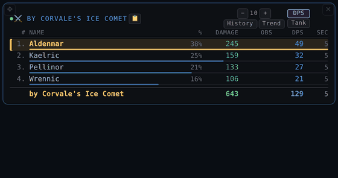

Your row stays highlighted wherever you rank. Pets fold under their owners. History keeps the last hundred fights; Trend graphs your own DPS tonight and this week. The **Tank** tab turns it around:

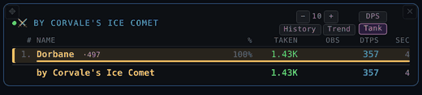

### Triggers: callouts and countdowns, spoken and shown

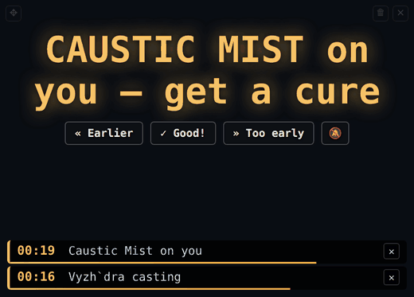

A log line fires a callout, speaks it, and starts a countdown. Guild triggers are edited by an officer on the website and reach every raider's Mimic within about two minutes. The **« Earlier / Good! / Too early** buttons send timing back to whoever wrote the trigger.

### Threat, and who is in the zone

<table>
<tr>
<td>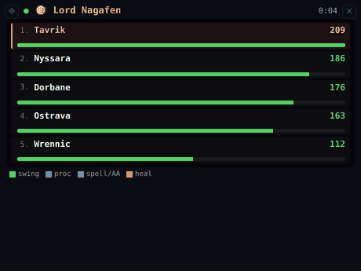</td>
<td>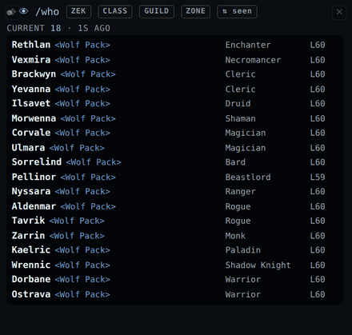</td>
</tr>
<tr>
<td>Threat per raider, split by swing, proc, spell and heal, so a healer sees the aggro coming.</td>
<td>A <code>/who</code> in game becomes a sortable list with class, level and guild, filterable by class.</td>
</tr>
</table>

### The main window

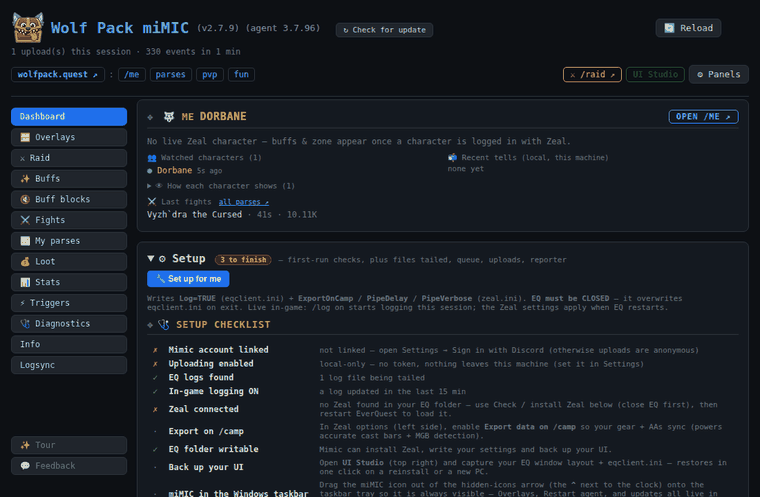

Setup checklist, every fight this session, recent trigger fires with a replay tool, your parses over time, crash review, lag meter. The same window serves at `http://127.0.0.1:7779/` for a plain browser.

### Discord: the boss board

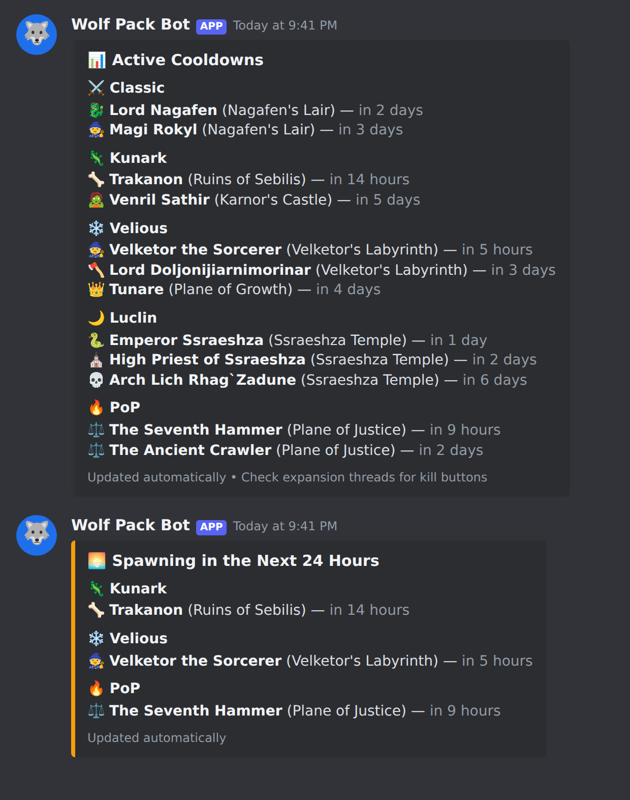

Rendered from the bot's own embed code over the real boss list, with made-up kill times. The board is edited in place, never re-posted; kill buttons live in one thread per expansion.

### The website

<table>
<tr>
<td><a href="https://wolfpack.quest">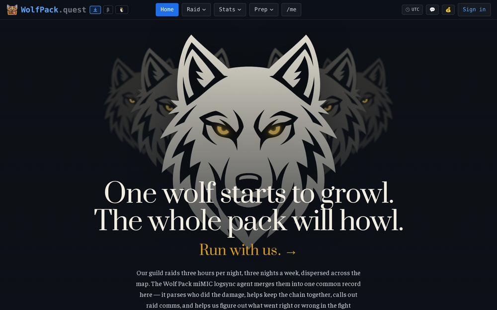</a></td>
<td><a href="https://wolfpack.quest/about">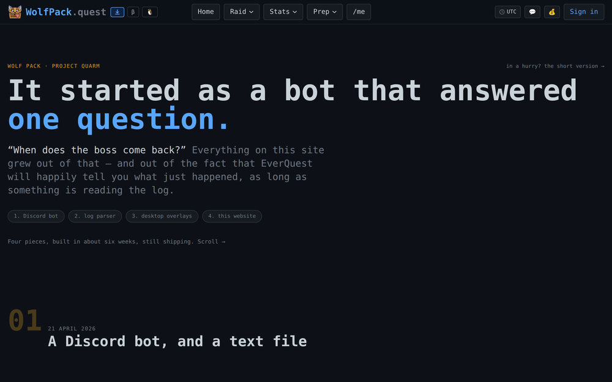</a></td>
<td><a href="https://wolfpack.quest/platform">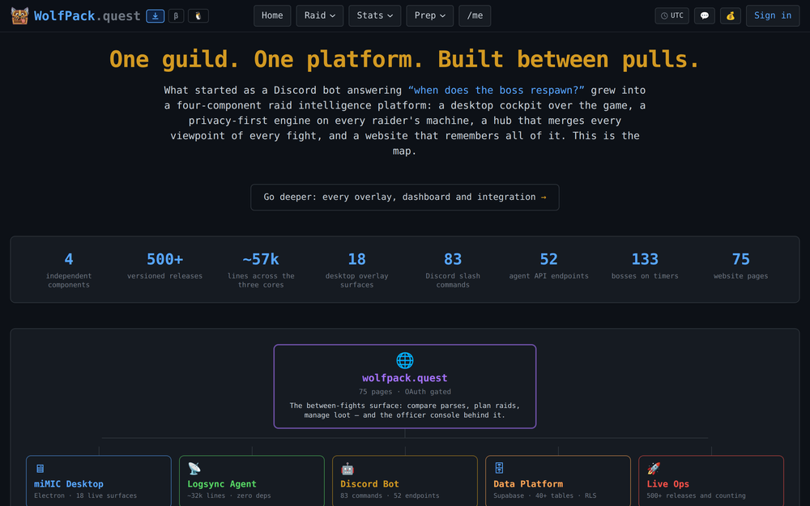</a></td>
</tr>
</table>

Public pages: the story, the platform, the roadmap, the Zeal tag icons, the database. Member pages: parses, buffs, PvP, Planes of Power flags and guide, leaderboards, loadouts, your own `/me`. Officer pages under `/admin`.

## Why a guild runs this instead of a parser and a spreadsheet

- **Every raider's log, one parse.** Each upload is a viewpoint; the bot merges them into one record of the kill, so one person's lag or line of sight does not decide the night's numbers.
- **Private chat never leaves the PC.** Officer chat, tells, group and custom channels are dropped at byte level before parsing. Signed out, Mimic makes zero calls to the guild's server.
- **Triggers are shared, not emailed.** An officer edits a trigger on the website; every Mimic has it in about two minutes. Personal triggers stay personal. GINA and EQLogParser packs import.
- **The charm break is called the moment the line is read**, and the timer overlay knows which tick a charm will break on.
- **Mob Info pooled from the whole raid.** Target a mob and see its stats, loot, spells, faction and who will come to its aid, from the catalog and from what every raider's Mimic has seen. Visited zones are cached on your PC.
- **The Command Center** shows healer mana, who needs a cure, whether Divine Intervention is up, who still has to hail the flag NPC.
- **Boss timers that survive a redeploy.** Boards in Discord are edited in place; kills post from Mimic without anyone typing a command; lockouts, instance kills and quakes are understood.
- **The fleet moves without a release.** Tuning, triggers and a kill switch are polled, not shipped; an agent fix hot-swaps to every PC without a new installer.
- **Reports with handles.** Every bug or idea gets an `FB-n`; when the fix ships, the bot updates the card and messages the person who filed it.
- **Honest about what it is not.** No code signing (SmartScreen warns), no self-serve data deletion yet, Zeal is needed for live HP and positions. [`docs/PRIVACY.md`](docs/PRIVACY.md) lists the gaps as plainly as the features.

## The four parts

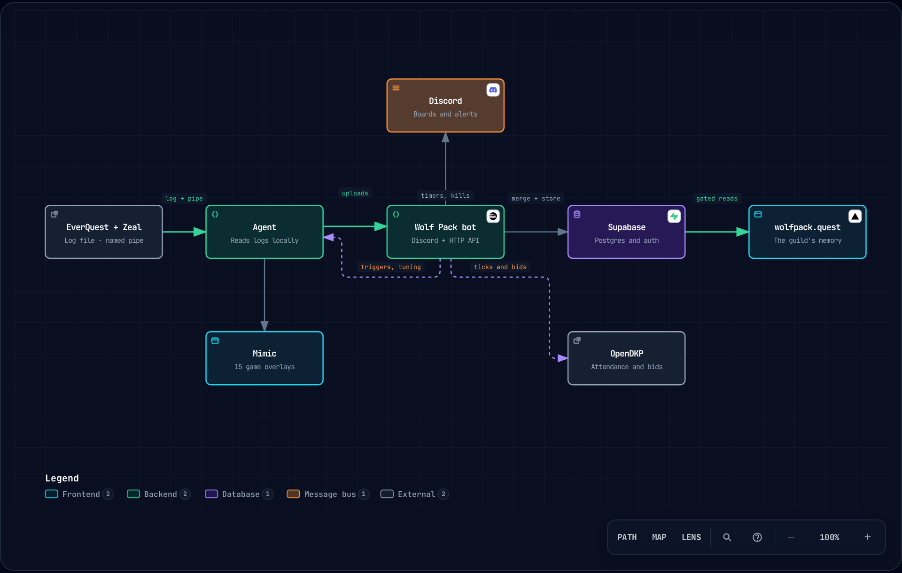

| Part | Where it lives | Runs on | Ships from |
|---|---|---|---|
| **Discord bot** and the `/api/agent/*` ingest API | `index.js`, `commands/`, `utils/` | Railway | `main` |
| **Website** [wolfpack.quest](https://wolfpack.quest) | `web/` (Next.js 14, Supabase auth) | Vercel | `main`; `beta` mirrors to `b.wolfpack.quest` |
| **Agent** (single-file Node, zero dependencies) | `packages/wolfpack-logsync/` | the raider's PC, inside Mimic or as `Parser.bat` | bundled with Mimic |
| **Mimic** (Electron, bundles Node and the agent) | `apps/mimic/` | the raider's PC, auto-updating | `release-mimic.yml`: stable from `main`, beta from `beta`, alpha from `alpha` |

Postgres on Supabase holds the EverQuest reference catalog (mirrored weekly from the server's data), the guild's data, and the bot's durable state. Versions live in each `package.json`; builds are on the [Releases](https://github.com/davehess/QuarmBossTracker/releases) page. The live diagram, with the data flow of one log line, is at [wolfpack.quest/platform/architecture](https://wolfpack.quest/platform/architecture).

## Get started

### I raid: install Mimic

1. Download the installer from the [latest release](https://github.com/davehess/QuarmBossTracker/releases/latest) (or `wolfpack.quest/mimic?direct=1`). It is not code-signed: SmartScreen → **More info → Run anyway**.
2. Run it. **Never install into your EverQuest folder.**
3. Sign in with Discord, or choose local-only. Point it at your EverQuest folder. Star your main.

The dashboard's **Setup checklist** names anything left: logging on, Zeal connected, export on `/camp`. Full walkthrough: [Install Mimic](docs/guide/02-raiders-install-mimic.md).

### I run a guild: stand up the bot and the site

You need a Discord application, a Supabase project, a Node host (Railway or Docker) and a Next.js host (Vercel). In order: [the Discord bot](docs/guide/03-officers-discord-bot.md) → [the database](docs/guide/05-database-supabase.md) → [the website](docs/guide/04-officers-website.md). The honest picture for another guild, including what is still hard-coded to ours and what the free tiers afford, is [Running it for another guild](docs/guide/11-self-hosting-another-guild.md).

### I want to change the code

```bash
git clone https://github.com/davehess/QuarmBossTracker.git
cd QuarmBossTracker && npm install          # Node 20
npm test && npm run lint && npm run check:dashboard && npm run golden:check
```

Read [`CLAUDE.md`](CLAUDE.md) (the architecture map and the rules that keep four components honest) and [Contributing](docs/guide/08-contributing.md). Pull requests: bot and web branch from `main`; agent and Mimic from `beta`.

## The handbook

One coherent set of instructions, written from the code, in [`docs/guide/`](docs/guide/00-README.md):

| | Chapter | For |
|---|---|---|
| 01 | [How it fits together](docs/guide/01-overview.md) | everyone |
| 02 | [Install and use Mimic](docs/guide/02-raiders-install-mimic.md) | raiders |
| 03 | [The Discord bot](docs/guide/03-officers-discord-bot.md) | officers |
| 04 | [The website](docs/guide/04-officers-website.md) | officers |
| 05 | [The database](docs/guide/05-database-supabase.md) | officers, contributors |
| 06 | [The standalone agent](docs/guide/06-standalone-agent.md) | raiders without Mimic, hosts |
| 07 | [Releases and branches](docs/guide/07-releases-and-branches.md) | maintainers |
| 08 | [Contributing](docs/guide/08-contributing.md) | contributors |
| 09 | [Privacy and your data](docs/guide/09-privacy-and-data.md) | raiders, officers |
| 10 | [Troubleshooting](docs/guide/10-troubleshooting.md) | everyone |
| 11 | [Running it for another guild](docs/guide/11-self-hosting-another-guild.md) | officers elsewhere |

Deeper material stays where it is: `CLAUDE.md` (architecture and working rules), `docs/HOW-ITS-BUILT.md` (feature → file index), `docs/STATUS.md` (the ledger), `docs/DECISIONS-*.md` (why), `docs/DESIGN-*.md` (designs, built and unbuilt).

## Feedback

Mimic's **Send feedback**, the dashboard's **Feedback** button, [wolfpack.quest/feedback](https://wolfpack.quest/feedback) or `/feedback` in the guild's Discord. Every report gets an `FB-n`; a commit that says `Fixes FB-n` moves it to "on beta" or "implemented" and the bot tells you. GitHub issues are public, so strip names and channels from any pasted log.

## Privacy

The filter runs before the parse. Officer chat, tells, group chat and custom channels never leave your PC; guild and raid chat do, and are posted to read-only Discord channels. Nothing is uploaded until you sign in; **Disconnect** stops it. Per-character switches hide a character from lists, keep its fights out of stats, or keep its inventory private, and the setup walkthrough asks the same question in one step. Other raiders' Mimic still records the fights you were in. The whole of it, gaps included: [`docs/PRIVACY.md`](docs/PRIVACY.md), mirrored at [wolfpack.quest/privacy](https://wolfpack.quest/privacy).

## License

**AGPL-3.0-or-later.** Read it, change it, fork it, run it for your guild: free, no time limit, no asking. The one obligation: if you modify it and let other people use your version over a network, offer them your source (§13). Nothing here is for profit; where money moves it is cost recovery for hosting. Binding text in [`LICENSE`](LICENSE); the plain-language version, including what a pull request agrees to, in [`docs/LICENSING.md`](docs/LICENSING.md).
