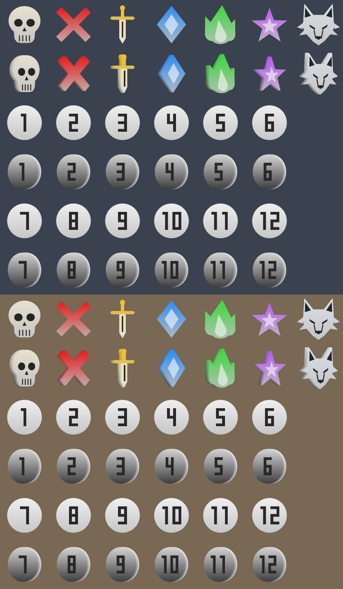

# Zeal PR draft — icon shapes and numbered badges 1–12 for `/tag`

*Drafted 2026-09-25 against Zeal v1.4.7 (`e24a3ed`). Branch **`tag-shapes`** on
the guild lead's fork (github.com/davehess/zeal/tree/tag-shapes, one commit,
`b83036b`); the same change is `0001-tag-icon-shapes.patch` here. The new geometry
file compiles clean under g++ `-Wall -Wextra -Wconversion -Wshadow`, and
clang-format with Zeal's own style reports nothing on the changed lines.*

*History: the first version (`fefa1c0`, keys `^1^`–`^6^` for the six icons) built
and rendered in game on 2026-09-25. All six drew over live mobs in the guild lead's
screenshot, and tags survived a camp and a `/q` in the combined test build. The
guild lead then asked: *"we should have numbered tags 1-12, each of those other
icons should have their own tag that's not a number."* The icons moved to letter
keys and `^1^`–`^12^` became numbered badges. Then *"add in a wolf"*, with the guild's
wolf-head logo as the reference: a head-on wolf, `^L^` (L being the only free letter
in "wolf"). That is `b83036b`. The wolf is generic enough for any raid; if
upstream would rather not carry it, dropping it is one `Kind`, one colour and one
key.*

**Where it came from:** the guild lead, 2026-09-25: *"We should make another
branch for additional zeal tag icons. see about generating some of these"*, with
a reference strip of six raid markers (skull, red X, gold sword, blue diamond,
green flame, purple star). The upstream maintainer had said in the Quarm Discord
that the tag shapes today are the ~6 arrow colours, the red octagon stop sign and
the pet paw, and that a skull was tried but *"I wasn't happy with how the 2-d
extrusion approach looked and ran out of time."*

**What's different about this approach:** a single extruded outline cannot carry
a skull's eye sockets or teeth. Here every shape is several flat parts, each
convex so it triangulates as a simple fan. Concave outlines come from overlapping
parts, and detail is a part standing 0.03 proud of the face in a dark, light or
contrasting accent tone: eye sockets, nose, teeth, the sword's fuller, the
diamond's facet, the flame's core, the star's inner star, a badge's digits. No
textures and no concave triangulation; the shapes use the same vertex-coloured,
unlit triangle-strip path as the arrow, octagon and paw.

**Numbered badges** are a white disc with seven-segment block digits. The digits
sit on each face separately, and the back copy is mirrored, so a badge never reads
backwards whichever face is toward you. A dark badge with light digits was also
rendered. It lost too much contrast on dark backgrounds, so white is the default;
changing it is one colour constant (`kNumberColorBase`). The digits then flip
automatically, because they take whichever accent contrasts with the badge.

**Keys:**

| Key | Shape | Colour | Vertices | Triangles drawn |
|---|---|---|---|---|
| `^K^` | Skull | bone `e8e2d1` | 264 | 492 |
| `^X^` | X | red `e81c1c` | 20 | 32 |
| `^A^` | Sword (points down) | gold `f2c02a` | 88 | 156 |
| `^D^` | Diamond | blue `2e8cf5` | 20 | 32 |
| `^F^` | Flame | green `3cd83c` | 216 | 416 |
| `^T^` | Star | purple `b55cf2` | 44 | 80 |
| `^L^` | Wolf's head | cool white `dce2ea` | 140 | 224 |
| `^1^` … `^12^` | Numbered badge | white `f0f0f0` (+n) | 138–258 | 256–448 |

**How the keys were chosen.**
- **Letters avoid R, O, Y, G, B, W, P and S on purpose.** An older client reads
  only the first character after `^`. With a letter nobody uses, it shows the text
  and no shape. With `S` for skull, it would have drawn a stop sign, the opposite
  message.
- **`^10^`–`^12^` are two-character keys.** They are read that way only when both
  characters are digits and a `^` follows, so no existing prefix changes meaning.
  An older client reads `^12^` as key `1`, which it doesn't know, so it shows the
  text only.
- The numbers encode as `kNumberColorBase + n`, because Zeal looks up a tag's shape
  from its colour. Every badge value was checked against every named colour for
  collisions.



*`preview.png`, rows top to bottom:*
- *the six icons face-on, then turned 35°;*
- *badges 1–6 face-on, then turned 150° (seen from behind: they still read the
  right way round);*
- *the same pair for badges 7–12.*

*All of that is shown twice, over a dusk-sky and over a sandstone background. The
image is rendered off-client from the real geometry code. `preview/dump.cpp`
compiles Zeal's `tag_shapes.cpp` unchanged, decodes the triangle strip exactly as
Direct3D does, and checks that every index is in range and that no join makes a
stray triangle. `preview/preview.py` rasterises the result with the same gradient
colouring as `TagArrows`. To regenerate after a geometry change (a third argument
previews another badge colour, e.g. `2a3340`):*

```
g++ -std=c++20 -I<zeal>/Zeal -o dump preview/dump.cpp <zeal>/Zeal/tag_shapes.cpp
./dump > meshes.json && python3 preview/preview.py meshes.json preview.png
```

The key parser (`ReadTagKey`, `GetTagArrowColor`, the badge helpers) was also
extracted verbatim from `nameplate.cpp` and tested with g++. The cases covered:
- `^10^`, `^12^`, `^1^`, `^R^`, `^R1^` and `^1` parse as expected;
- `13` and `0` give no shape;
- the letters map to their icons;
- no badge value collides with a named colour.

For scale: the arrow is 182 vertices and the paw 560.

## Build and test locally

Same clone as the Bandolier branch (`C:\dev\zeal-pr\Zeal`). In a Developer
Command Prompt for VS 2022, and with no inline `# comments` (cmd.exe passes them
through to the command). The branch was force-pushed, so reset to it if you
already have it:

```
cd C:\dev\zeal-pr\Zeal
git fetch origin
git switch tag-shapes
git reset --hard origin/tag-shapes
git commit --amend --no-edit --reset-author
git push --force-with-lease origin tag-shapes
msbuild /m /p:Configuration=Release /p:Platform=x86 /p:zeal_build_version=tagshapes Zeal.sln
```

(`git switch -c tag-shapes origin/tag-shapes` instead of the switch + reset the
first time.) The amend makes the commit yours before the PR, the same as for
Bandolier. To test everything at once instead, build `test-all`, which is Bandolier
+ this + tag persistence. Never open a PR from `test-all`.

---

## PR title

`Add icon shapes and numbered badges 1-12 for /tag`

## PR body (paste as-is, and attach preview.png)

Tags can show a coloured arrow, the stop sign or the paw today. Raid marking wants
more distinct symbols. This adds the familiar skull / X / sword / diamond / flame /
star set, and numbers for kill or crowd-control order, so a caller can say "kill
skull, then 3" and everyone sees it.

**What changes**

- Icon keys after `^`: `K` skull, `X` red X, `A` gold sword, `D` blue diamond, `F`
  green flame, `T` purple star, `L` wolf's head. They avoid R/O/Y/G/B/W/P/S on
  purpose. An older
  client reads only the first key character, so an unused letter shows the text
  with no shape rather than a different, wrong one.
- Numbered badges `^1^` to `^12^`: a white disc with block digits.
  - `^10^` to `^12^` are read as two-digit keys. That happens only when both
    characters are digits and a `^` follows, so no existing prefix changes
    meaning.
  - The digits sit on each face separately, with the back copy mirrored, so a
    badge reads correctly from either side.
- `tag_shapes.cpp/.h` (new) holds the geometry, with no DirectX dependency.
  - Every shape is flat parts extruded to the same thickness as the octagon and
    paw.
  - Each part is convex (or star-shaped about its centre), so it triangulates as
    a simple fan. Concave outlines come from overlapping parts.
  - Detail is a part standing slightly proud of the face, in a dark, light or
    contrasting accent tone.
  - No textures and no concave triangulation.
- `TagArrows` builds the meshes at startup, colours them with the existing face
  gradients plus the accent tones, and sizes the vertex buffer to hold every shape
  at once alongside the arrow colour cache.
- The shape is now picked from the tag's own colour, before a nameplate colour is
  substituted, so a nameplate colour can no longer collide with a shape's colour.
- Prettyprint, the target tooltip and `/tag` help name the new shapes.
- README: the new keys and examples.

The attached preview is rendered off-client from `tag_shapes.cpp` itself: the
triangle strips are decoded as Direct3D draws them, with the same gradient
colouring.

**Test plan**

1. Build; `/tag on`; target an NPC; `/tag local ^K^Kill first`: a skull above the
   nameplate with the text "Kill first".
2. `^X^`, `^A^`, `^D^`, `^F^`, `^T^`, `^L^` on other NPCs: X, sword, diamond,
   flame, star, wolf.
   Each turns to face you as you walk around it, like the paw and stop sign do.
3. `^1^` through `^12^`: numbered badges. Walk around one; the number never reads
   backwards.
4. `^R^`, `^P^`, `^S^`: the arrow, paw and stop sign are unchanged.
5. Many shapes at once, plus a few arrow colours: every shape draws (the vertex
   buffer holds them all) and none flickers.
6. `/tag local ^-^` clears the shape and leaves the text.
7. With `/tag prettyprint on`, an rsay tag reads "… => <name> (Skull)" or "(#7)".
   With `/tag tooltip on`, the target window names the shape.
8. A client without this change receiving `^K^Kill first` or `^12^` shows the text
   with no shape.

---

## Our side, once it is merged upstream

Nothing ships to our fleet until it is in an official Zeal release. Then:

- The agent's tag parser (`_ZEAL_TAG_SHAPES` in
  `packages/wolfpack-logsync/index.js`) knows only R/O/Y/G/B/W/P/S, and reads a
  single-character key between the `^`s. It needs the seven letters, and `1`–`12`
  including the two-digit form, so Extended Target can draw the icon or number.
- The prettyprint regex beside it (`Arrow:[ROYGBW]|Paw|Stop`) needs the seven names
  and `#1`–`#12`. Otherwise a prettyprinted line reads the shape into the target's
  name, as "a gnoll (Skull)".
